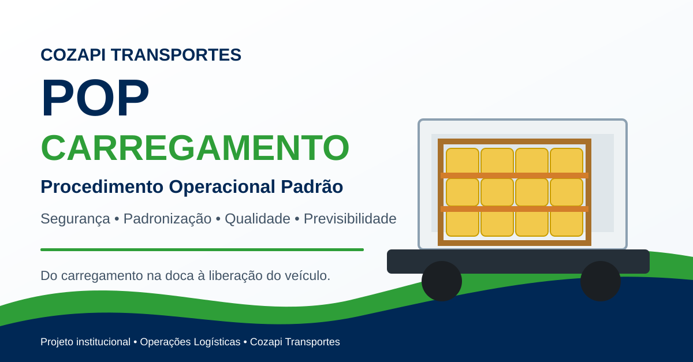

<p align="center">
  
</p>

# POP Padrão Cozapi — Carregamento

> Procedimento Operacional Padrão desenvolvido para orientar o processo de carregamento da **Cozapi Transportes**, com foco em segurança, padronização, integridade da carga, preservação do veículo e previsibilidade logística.


## Sobre o projeto

Este projeto transforma um processo operacional de carregamento em um material institucional, visual e colaborativo para uso com embarcadores parceiros, equipes de doca e motoristas.

A proposta é estabelecer um **padrão claro de execução e conferência**, reduzindo variações no carregamento e fortalecendo a tomada de decisão antes da liberação do veículo.

### Objetivos principais

- Proteger as pessoas envolvidas na operação.
- Preservar a integridade dos produtos transportados.
- Melhorar a estabilidade e a distribuição da carga.
- Reduzir retrabalho, avarias e impactos logísticos.
- Padronizar preparação, acondicionamento, separação e peação.
- Criar uma conferência final compartilhada entre embarcador e motorista.
- Aumentar a previsibilidade operacional desde a doca até a entrega.

## Fluxo operacional

```text
PREPARAR → ACONDICIONAR → SEPARAR → PEAR/AMARRAR → DISTRIBUIR → CONFERIR → LIBERAR
```

## Princípios do POP

**Vida:** segurança das pessoas em primeiro lugar.

**Produto:** preservação da embalagem, conteúdo e características comerciais da mercadoria.

**Frota:** distribuição de peso e geometria do carregamento voltadas à estabilidade e preservação do veículo.

**Responsabilidade compartilhada:** embarcador e motorista validam juntos a liberação do veículo.

---

## Padrão oficial das referências visuais

Todas as imagens com baldes seguem o mesmo padrão operacional consolidado:

- **2 pallets lado a lado** na largura útil da carroceria;
- **3 baldes de altura**, no máximo;
- **nunca pallet sobre pallet**;
- baldes no padrão visual **Ourocolos**, conforme as referências do projeto;
- sem espaços livres relevantes entre pallets, no centro ou nas laterais;
- film stretch envolvendo e estabilizando o conjunto;
- chapas de madeira/compensado utilizadas como separação e proteção;
- cantoneiras e proteções aplicadas **na vertical e na horizontal**;
- cintas e/ou cordas apoiadas sobre as proteções, sem contato direto com os baldes;
- distribuição simétrica e estável no assoalho.

### Tipos de carroceria representados

**Baú:** dois pallets lado a lado, três baldes de altura e ocupação eficiente da largura útil.

**Carroceria grade baixa de madeira:** dois pallets lado a lado, três baldes de altura e amarrações ancoradas nos pontos adequados da carroceria.

Mais detalhes em [`PADRAO_VISUAL_E_OPERACIONAL.md`](PADRAO_VISUAL_E_OPERACIONAL.md).

---

## Etapas do procedimento

### 1. Preparação da doca e do assoalho

Assoalho limpo e seco, ausência de pregos/farpas, materiais de peação preparados e conferência visual dos volumes.

### 2. Acondicionamento e estabilização

Unificação com film stretch, limite de três baldes de altura, base estável e volumes dentro do perímetro útil.

### 3. Separação e compatibilidade dos lotes

Uso de chapas de madeira ou divisórias sempre que houver lotes diferentes, risco de atrito ou pontos de pressão.

### 4. Peação, amarração e travamento

Cintas/cordas com tensão adequada, proteções horizontais e verticais, ancoragem correta e sem contato direto com os baldes.

### 5. Distribuição simétrica

Dois pallets lado a lado, carga centralizada, peso equilibrado e sem espaços livres relevantes.

### 6. Conferência e liberação

A saída do veículo ocorre somente após conferência conjunta do embarcador e do motorista.

---

## Checklist final

- [ ] Posição dos baldes e itens
- [ ] Empilhamento máximo dos baldes e itens
- [ ] Peletização e film stretch
- [ ] Chapas de madeiras
- [ ] Amarração da carga
- [ ] Espaçamento
- [ ] Fazer fotos para registro
- [ ] Observações registradas

O documento deve conter **assinatura do embarcador, assinatura do motorista e data**.

Veja [`CHECKLIST_FINAL.md`](CHECKLIST_FINAL.md).

---

## LinkedIn / Portfólio

O projeto inclui texto completo de publicação e sugestão de carrossel para LinkedIn em [`LINKEDIN.md`](LINKEDIN.md).

### Carrossel sugerido

1. Capa — POP Padrão Cozapi: Carregamento
2. Contexto e objetivo
3. Vida, Produto, Frota e Motorista
4. Preparação da doca
5. Acondicionamento correto
6. Separação de lotes
7. Peação e amarração
8. Distribuição simétrica
9. Checklist final
10. Ganhos operacionais

---

## Estrutura do repositório

```text
pop-padrao-cozapi-carregamento/
├── README.md
├── PADRAO_VISUAL_E_OPERACIONAL.md
├── CHECKLIST_FINAL.md
├── LINKEDIN.md
└── assets/
    └── capa-linkedin.svg
```

> **Processo bem definido gera segurança, eficiência e previsibilidade.**

**Cozapi Transportes — POP Padrão de Carregamento**
